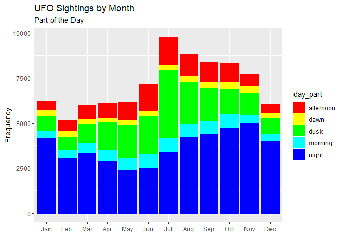
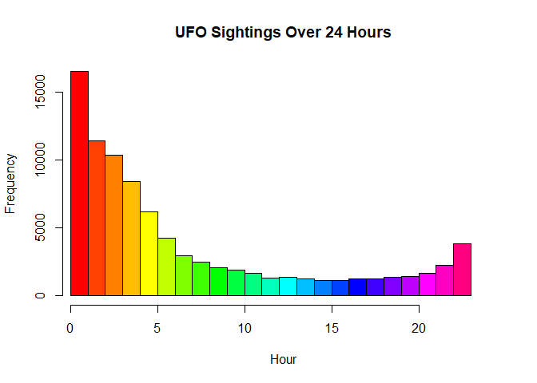
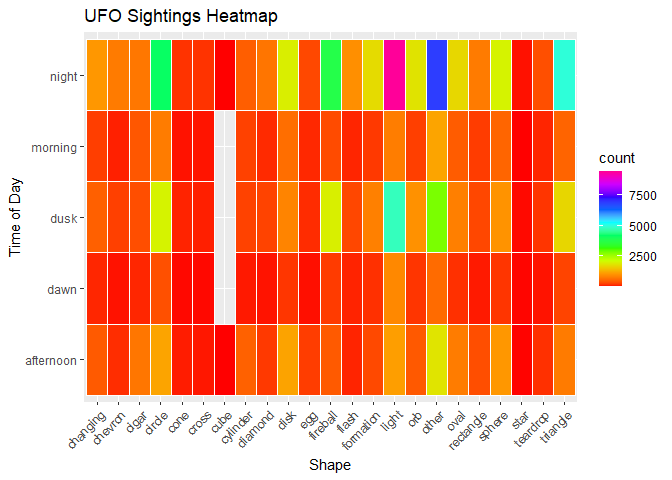

UFO Sightings
================
Kit Applegate
2023-06-20

This Data is from the [National UFO Reporting
Center](https://nuforc.org/webreports/ndxshape.html) , cleaned and
enriched with data from sunrise-sunset.org by Jon Harmon. IT was part of
the this week \#tidytuesday data set.

``` r
# Load required libraries

# The 'tidyverse' library is a collection of packages for data manipulation and visualization.
library(tidyverse)

# The 'lubridate' library provides functions for working with dates and times.
library(lubridate)

# The 'chron' library provides functions for handling dates and times in a compact format.
library(chron)

# The 'scales' library provides functions for scaling and formatting data.
library(scales)

# The 'viridis' library provides color scales for visualizations.
library(viridis)

# Read data files

# Read the 'ufo_sightings.csv' file from the specified URL and store it in the 'ufo_sightings' variable.
ufo_sightings <- readr::read_csv('https://raw.githubusercontent.com/rfordatascience/tidytuesday/master/data/2023/2023-06-20/ufo_sightings.csv')

# Read the 'shape.List.csv' file from the local directory and store it in the 'shape.List' variable.
shape.List <- read.csv("raw.Data/shape.List.csv")
```

``` r
# Data Manipulation

# Join the 'ufo_sightings' and 'shape.List' dataframes based on the 'shape' and 'Original' columns,
# and store the result in the 'sightings' variable.
sightings <- left_join(ufo_sightings, shape.List %>% unique(), by = c("shape" = "Original")) %>%
  mutate(Shape = coalesce(New, shape)) %>%  # Create a new 'Shape' column by filling missing values with the original 'shape'
  select(-New)  # Remove the 'New' column from the dataframe

# Add a 'Time' column to the 'sightings' dataframe, derived from the 'reported_date_time' column.
sightings$Time <- format(as.POSIXct(sightings$reported_date_time), format = "%H:%M:%S")

# Convert the 'reported_date_time' column to a 'Date' format and store it in the 'Date' column.
sightings$Date <- as.Date(as.POSIXct(sightings$reported_date_time, 'GMT'))

# Add 'Year', 'Month', and 'Day' columns to the 'sightings' dataframe using the 'Date' column.
sightings <- sightings %>%
  dplyr::mutate(
    Year = lubridate::year(Date),
    Month = lubridate::month(Date),
    Day = lubridate::day(Date)
  )

# Filter the 'sightings' dataframe to include only records with 'country_code' equal to "US",
# and select specific columns for analysis.
sightings <- sightings %>%
  filter(country_code == "US") %>%
  select(
    "Year", "Month", "Day", "Time", "city", "state", "shape", "duration_seconds",
    "summary", "day_part"
  )

# Convert the 'Month' column to a factor with ordered levels.
sightings$Month <- factor(month.abb[sightings$Month], levels = month.abb)

# Filter the 'sightings' dataframe to remove records with "HOAX" in the 'summary' column (case-insensitive).
sightings_filtered <- sightings %>%
  filter(!grepl("HOAX", summary, ignore.case = TRUE))

# Perform additional mutations on the 'sightings_filtered' dataframe, including calculations and recoding of columns.
sightings.Mutate <- sightings_filtered %>%
  mutate(
    minutes = round(duration_seconds / 60, 2),
    hours = round(minutes / 60, 2),
    days = round(hours / 24, 2),
    shape = ifelse(shape == "unknown" | is.na(shape), "other", shape),
    day_part = case_when(
      day_part %in% c("nautical dusk", "astronomical dusk", "civil dusk") ~ "dusk",
      day_part %in% c("civil dawn", "nautical dawn", "astronomical dawn") ~ "dawn",
      TRUE ~ day_part
    )
  )

# Convert the 'Time' column in the 'sightings.Mutate' dataframe to the 'times' class.
sightings.Mutate$Time <- times(format(sightings.Mutate$Time, format = "%H:%M:%S"))

# Convert the 'Month' column in the 'sightings.Mutate' dataframe to a factor.
sightings.Mutate$Month <- as.factor(sightings.Mutate$Month)
```

``` r
# Data Visualization

# Group the 'sightings.Mutate' dataframe by 'Month' and 'day_part', and calculate the total number of sightings in each group.
# Store the result in the 'total' column and arrange the dataframe in descending order of 'total'.
sightings_summary <- sightings.Mutate %>%
  group_by(Month, day_part) %>%
  summarise(total = n()) %>%
  arrange(desc(total))

# Remove any rows with missing values (NA) from the 'sightings_summary' dataframe.
sightings_summary <- na.omit(sightings_summary)

# Create a bar plot using 'ggplot', mapping 'Month' to the x-axis, 'total' to the y-axis, and 'day_part' to fill and color.
# Use 'geom_col()' to display the bars, and set the plot labels and title.
# Customize the fill and color scales using the 'rainbow' color palette.
ggplot(sightings_summary, aes(x = Month, y = total, fill = day_part, color = day_part)) +
  geom_col() +
  labs(title = "UFO Sightings by Month",
       subtitle = "Part of the Day",
       y = "Frequency",
       x = "") +
  scale_fill_manual(values = rainbow(length(unique(sightings.Mutate$day_part)))) +
  scale_color_manual(values = rainbow(length(unique(sightings.Mutate$day_part))))
```

<!-- -->

``` r
sighting_times <- strptime(sightings.Mutate$Time, format = "%H:%M:%S")

# Extract the hour component from the POSIXlt format
sighting_hours <- as.integer(format(sighting_times, format = "%H"))

# Create a histogram using the extracted hour component
hist(sighting_hours, breaks = 25, xlab = "Hour", ylab = "Frequency", main = "UFO Sightings Over 24 Hours", col = rainbow(24),
     xlim = c(.5, 24))
```

<!-- -->

``` r
heatmap_data <- sightings.Mutate %>%
  group_by(day_part, shape) %>%
  summarise(count = n()) %>%
  na.omit()

# Create the heatmap plot
ggplot(heatmap_data, aes(x = shape, y = day_part, fill = count)) +
  geom_tile(color = "white") +
  scale_fill_gradientn(colours = rainbow(10)) +
  labs(x = "Shape", y = "Time of Day", title = "UFO Sightings Heatmap") +
  theme(axis.text.x = element_text(angle = 45, hjust = 1))
```

<!-- -->
